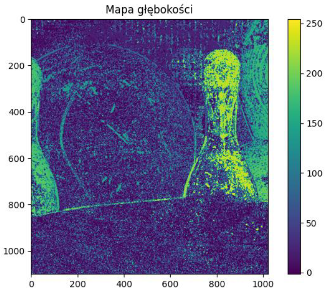

# Depth map
### Small description

## Task is to find depth of the object. Using offset from two pictures taken in different places.
Goal is to estimate Z

# Input pic

## Depth map without smoothing

## Convolutional smoothing using mean filter

## Convolutional smoothing using median filter

## Depth map with smaller window

## Ground truth

