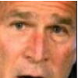

# Segmentation based on skin tone

### Skin colors

Getting threshold from Bush face

Histogram of colors using YCrCb

### Result on  Arnold

# Template matching

Average face made from faces data set

