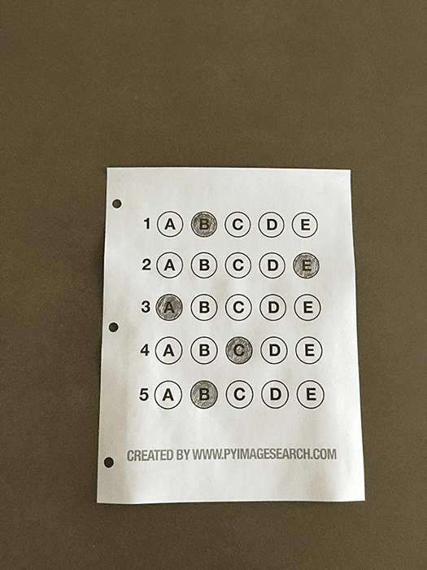
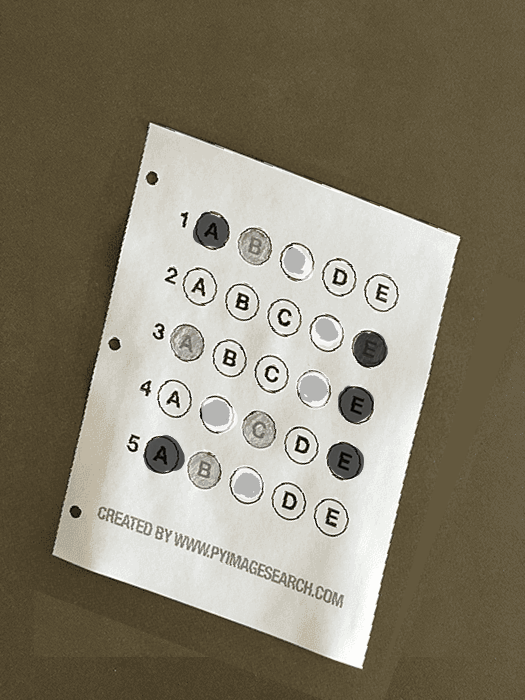
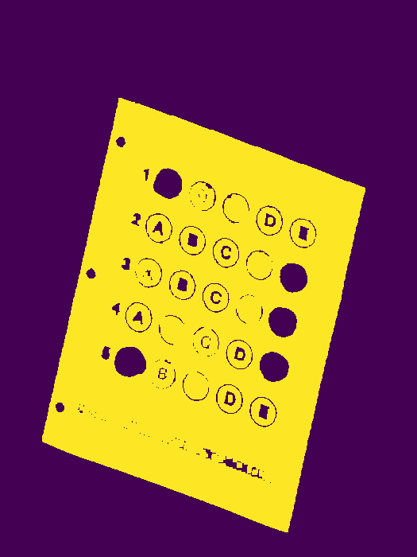
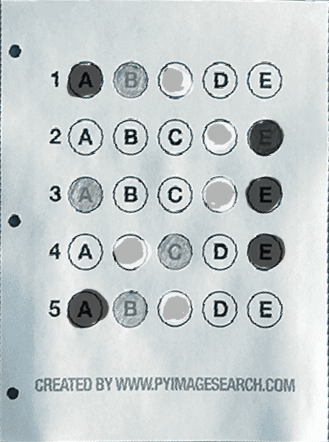
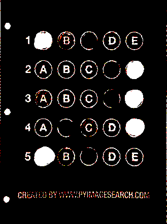
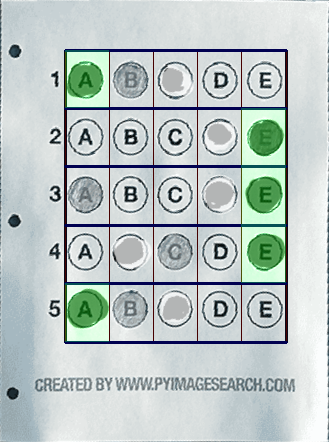

# Reading answers from sheet

### Input a

### Input b

### Input c

# Pipeline
## Contour detection

## Morphing to proper orientation

## Thresholding

# Result
## Grid sampling and pixel counting

