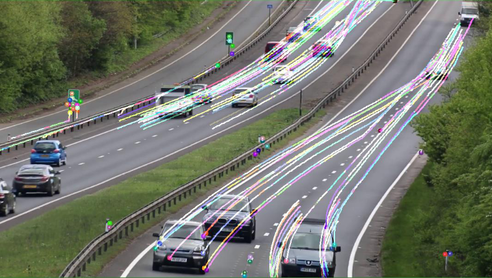
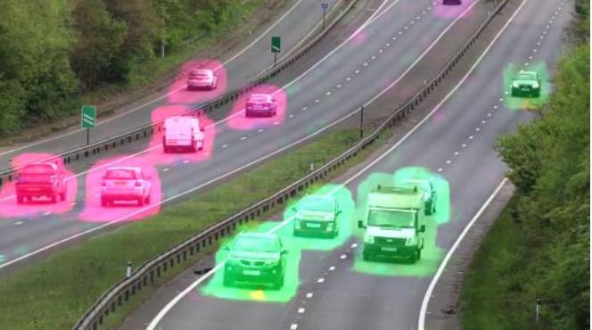
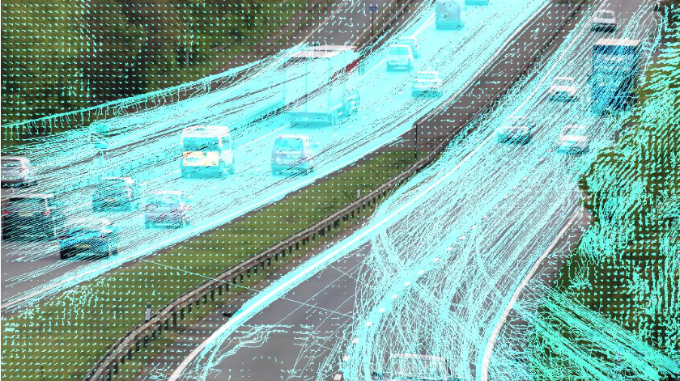
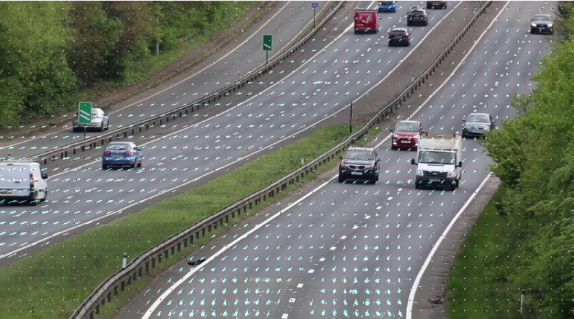

# Optical flow

### Lucas Kanade with default parameters

### Gunnar Farnebeck
Color means flow direction and intensity.

## Lucas Kanade with uniform grid sampling

#### Smoothing and damping long lines.

